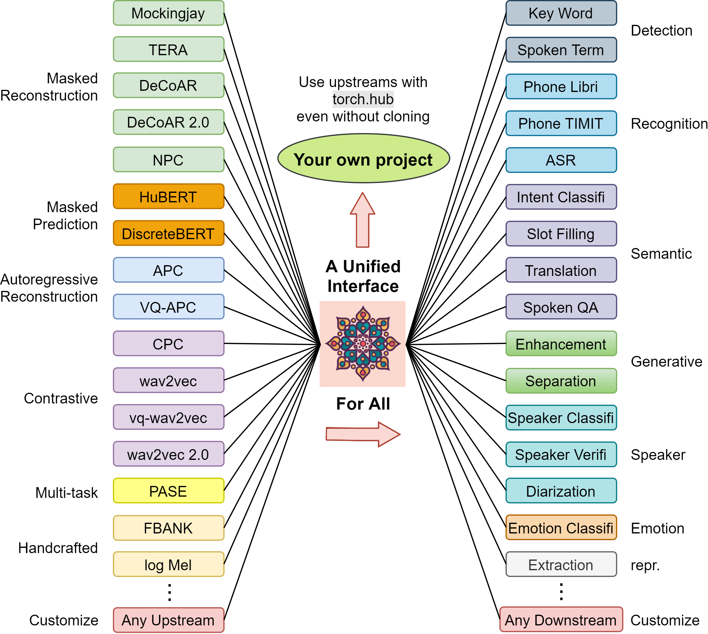
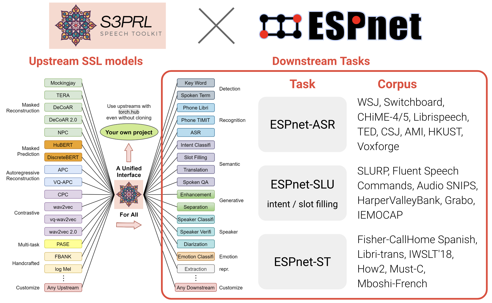

I am an enthusiast of open-source. I believe that impact comes from helping others achieve what they originally couldn't, and releasing softwares and datasets is the most direct approach to realize this goal. Here are some open-source projects I have been involved with.

## The S3PRL Toolkit (co-founder)


I co-founded the [S3PRL Toolkit](https://github.com/s3prl/s3prl) with [Andy T. Liu (NTU)](https://andi611.github.io/) in 2019, with support and advice from [Hung-yi Lee (NTU)](https://speech.ee.ntu.edu.tw/~hylee/index.php). Throughout several years, I have collaborated with over [40 contributors](https://github.com/s3prl/s3prl/graphs/contributors), to whom I extend my sincere thanks.
The major contributors are highlighted in the [Change Log](https://github.com/s3prl/s3prl?tab=readme-ov-file#change-log). The toolkit supports the pre-training of several classical SSL methods, benchmarking of numerous downstream tasks, and offers the most [comprehensive collection of pre-trained SSL models](https://s3prl.github.io/s3prl/tutorial/upstream_collection.html) to track research history. It is widely used by the community, including toolkits like [ESPnet](https://github.com/espnet/espnet?tab=readme-ov-file#asr-automatic-speech-recognition), [S3PRL-VC](https://github.com/unilight/s3prl-vc) and [numerous open-source projects](https://github.com/s3prl/s3prl/network/dependents).

---

Here is a high-level illustration of how S3PRL might help you. We support to leverage numerous SSL representations on numerous speech processing tasks in our [GitHub codebase](https://github.com/s3prl/s3prl):



---

We also modularize all the SSL models into a standalone [PyPi package](https://pypi.org/project/s3prl/) so that you can easily install it and use it without depending on our entire codebase. The following shows a simple example and you can find more details in our [documentation](https://s3prl.github.io/s3prl/).

1. Install the S3PRL package:

    ```sh
    pip install s3prl
    ```

2. Use it to extract representations for your own audio:

    ```python
    import torch
    from s3prl.nn import S3PRLUpstream

    model = S3PRLUpstream("hubert")
    model.eval()

    with torch.no_grad():
        wavs = torch.randn(2, 16000 * 2)
        wavs_len = torch.LongTensor([16000 * 1, 16000 * 2])
        all_hs, all_hs_len = model(wavs, wavs_len)

    for hs, hs_len in zip(all_hs, all_hs_len):
        assert isinstance(hs, torch.FloatTensor)
        assert isinstance(hs_len, torch.LongTensor)

        batch_size, max_seq_len, hidden_size = hs.shape
        assert hs_len.dim() == 1
    ```

---

With this modularization, we have achieved close integration with the general speech processing toolkit [ESPnet](https://github.com/espnet/espnet), enabling the use of SSL models for a broader range of speech processing tasks and corpora to achieve state-of-the-art (SOTA) results (kudos to the [ESPnet Team](https://www.wavlab.org/open_source)):



You can start the journey of SSL with the following entry points:

- S3PRL: [A simple SUPERB downstream task](https://github.com/s3prl/s3prl/blob/main/s3prl/downstream/docs/superb.md#pr-phoneme-recognition)
- ESPnet: [Levearging S3PRL for ASR](https://github.com/espnet/espnet/tree/master/egs2/librispeech/asr1#self-supervised-learning-features-hubert_large_ll60k-conformer-utt_mvn-with-transformer-lm)
